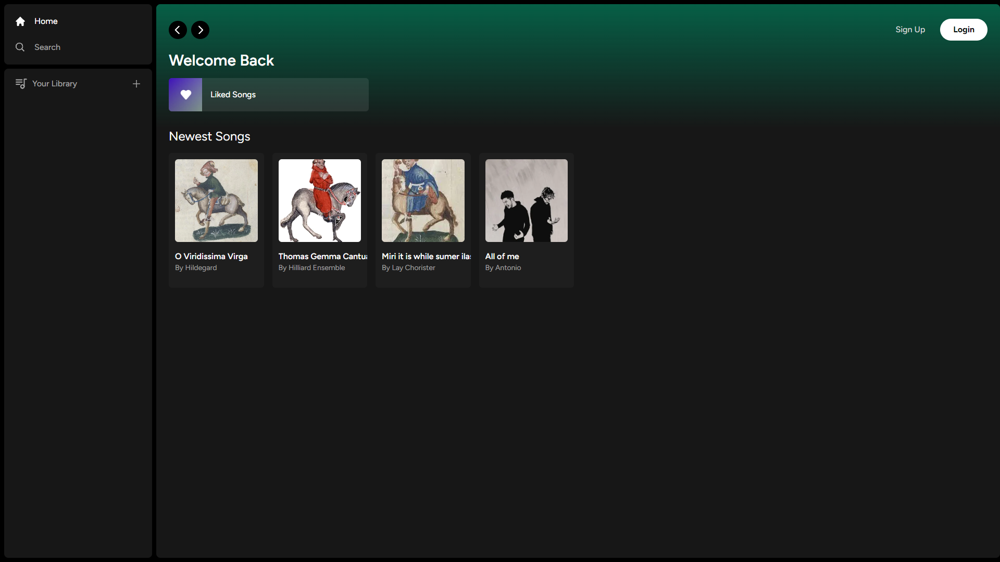

# Spotify Clone

This project is a detailed replication of the popular music streaming platform, Spotify. The clone is built using Next.js, React, Stripe, Supabase, PostgreSQL, and Tailwind CSS.

## Project Overview

The Spotify Clone lets users experience a near-real Spotify platform, where they can explore a multitude of songs, create personal playlists, discover new music, and much more. This project exhibits integration with Stripe for smooth payment processing, uses Supabase as the backend, PostgreSQL for database handling, and is styled using the Tailwind CSS framework.

Check out the live demo of the project: [Spotify Clone](https://spotify-clone-thetutran.vercel.app/)

## Key Features

- **Song Upload:** Users can upload their own music, enhancing their personalized music experience.
- **Stripe Integration:** This provides seamless payment processing for premium features.
- **Supabase and PostgreSQL Database Handling:** Efficient database management enhances the overall user experience.
- **Tailwind CSS Design:** Ensures a sleek and user-friendly interface.
- **Full Responsiveness:** Optimized for all devices for an optimal user experience.
- **User Authentication:** Secure access to personalized features, integrated with Supabase and Github.
- **File and Image Upload:** Facilitated using Supabase storage.
- **Client-Side Form Validation:** Implemented using react-hook-form for seamless user interactions.
- **Server-Side Error Handling:** Utilizes react-toast for efficient error management.
- **Audio Playback:** Allows users to listen to their favorite songs.
- **Favorites System:** Users can save and easily access their favorite songs.
- **Playlists and Liked Songs System:** Allows users to organize and manage their music collections.
- **Advanced Player Component:** Provides enhanced features and controls for the music player.
- **Stripe Recurring Payments:** Ensures easy management of premium subscriptions.
- **Direct Database Access:** Efficient data retrieval in server-side React components, bypassing the need for an API.

## Contributing

Contributions are welcome! Feel free to use the code or learn from it. 

## Acknowledgements

This project was developed based on the tutorial by CodeWithAntonio. You can check out the tutorial [here](https://www.youtube.com/channel/UCVyRiMvfUNMA1UPlDPzG5Ow).

## Contact

Name: Tu Tran

Email: tutran.stl@gmail.com  

YouTube Video: [Link to YouTube Video](https://www.youtube.com/watch?v=fScSFhCtfIc)
